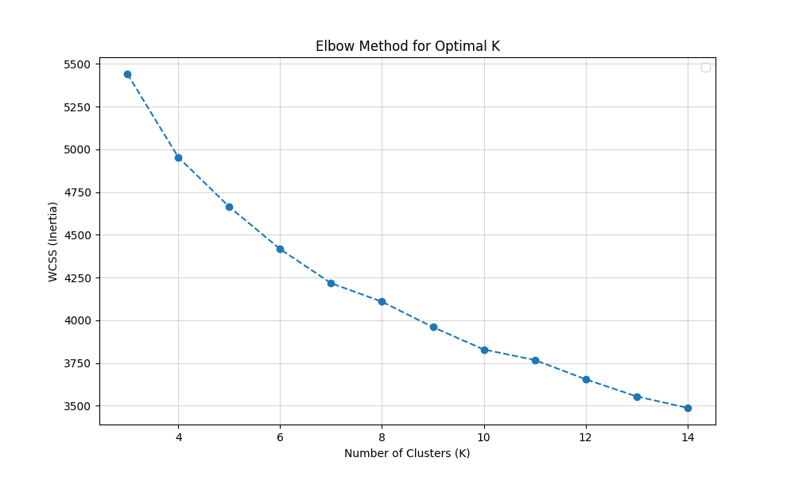
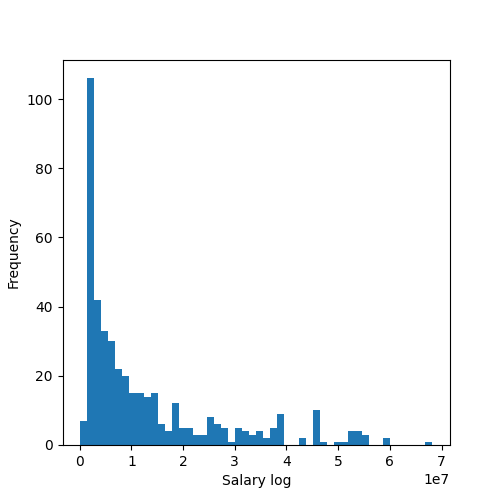
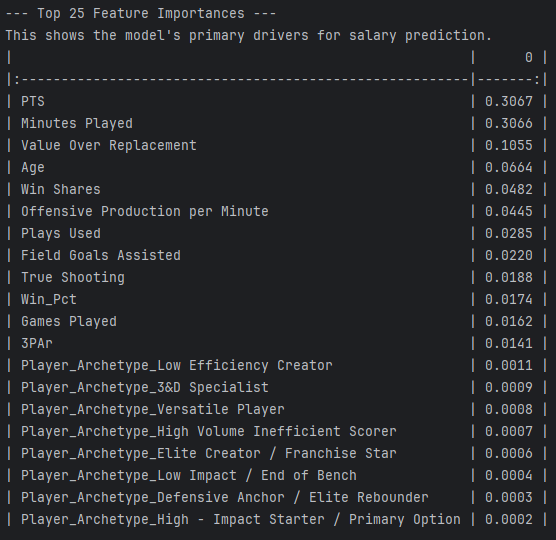
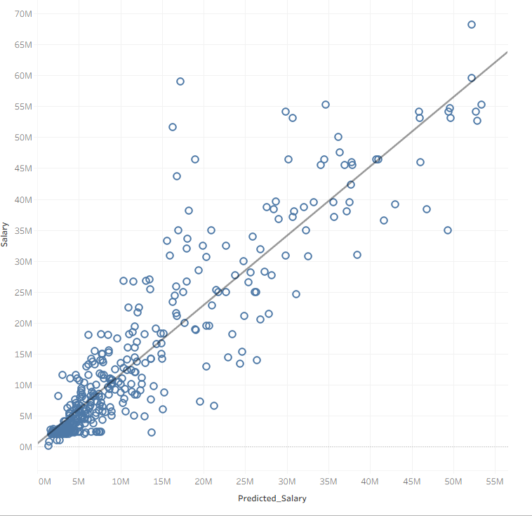
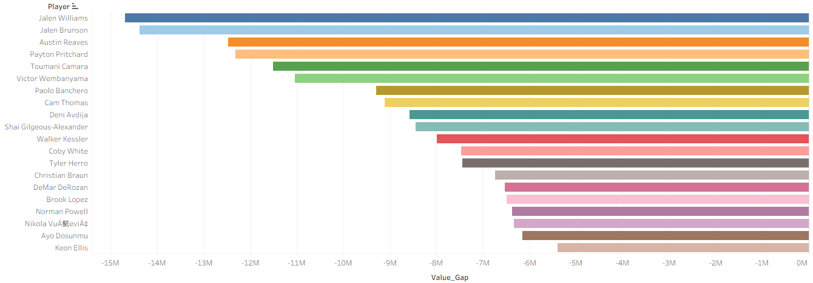
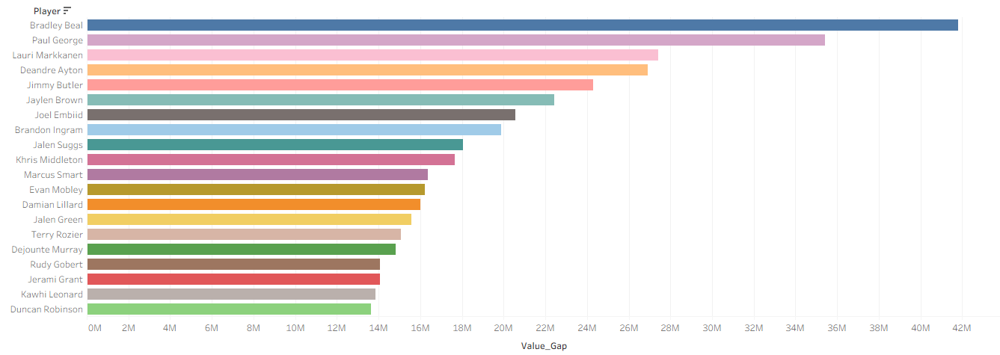
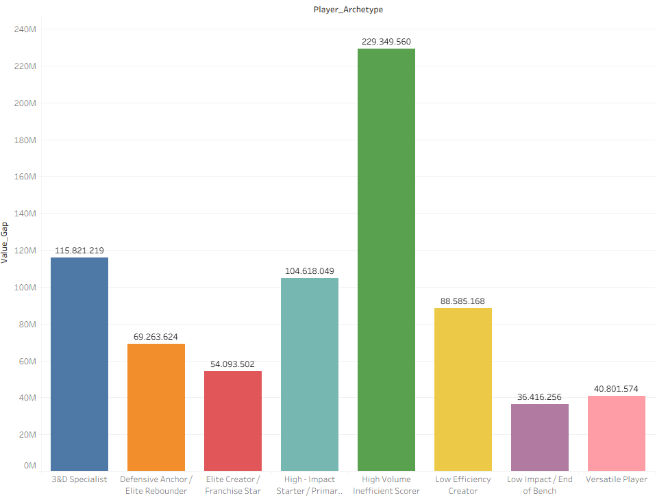

# 🏀 NBA Moneyball 2025: Analizando la Ineficiencia del Mercado Salarial

> *"Siempre discuto con mi hermano sobre la NBA. Yo le digo que hay jugadores que cobran millonadas injustificadas solo por 'anotar mucho', mientras que otros cargan con el equipo cobrando miserias en comparación. Él me decía que el mercado es eficiente y paga por calidad. Yo decidí usar Data Science para demostrarle que se equivocaba."*

Este proyecto **End-to-End** utiliza técnicas de Web Scraping, Clustering (No Supervisado) y Regresión (Supervisado) para realizar una auditoría algorítmica de los salarios de la temporada 2024-25. El objetivo es identificar objetivamente qué jugadores son **"Gangas" (Undervalued)** y cuáles son **"Tóxicos" (Overvalued)**.

---

## 🎯 Objetivo y Stack Tecnológico

El límite salarial (Salary Cap) hace que la gestión eficiente del dinero sea la clave para ganar anillos. Este proyecto busca responder:
1.  ¿Pagan los equipos por victorias (Win Shares) o por marketing (Puntos)?
2.  ¿Existen arquetipos de jugadores sistemáticamente sobrepagados?
3.  ¿Quiénes son los jugadores más rentables de la liga hoy?

**Stack:** `Python` `Pandas` (Scraping) `Pandas` (ETL) `Scikit-learn` (Clustering & Random Forest) `Matplotlib/Seaborn/Tableau` (Dataviz).

---

## ⚙️ Fase 1: Ingeniería de Datos (Scraping & Cleaning)

Para garantizar datos actualizados, evité datasets estáticos (Kaggle) y construí un pipeline ETL personalizado extrayendo datos directamente de **Basketball-Reference**.

### 1. Web Scraping 
Para realizar el scrapping utilizé el comando de la librería Pandas `read_html(url)` que permite acceder a los datos de las tablas de las páginas web: 
* **Extracción:** Automaticé la descarga de 4 fuentes de datos clave:
    * **Stats Per Game:** Métricas de volumen (Puntos, Rebotes, Asistencias).
    * **Advanced Stats:** Métricas de eficiencia (VORP, PER, WS/48, USG%).
    * **Salaries 2024-25:** Datos contractuales, limpiando símbolos de moneda y convirtiéndolos a enteros.
    * **Standings:** Clasificación de equipos para calcular el contexto ganador (`Win_Pct`).

### 2. Data Cleaning & Logic
La limpieza de datos fue la fase más crítica para evitar duplicados y sesgos en el modelo:

* **El Algoritmo de "Traded Players":**
    Los jugadores traspasados a mitad de temporada generan múltiples filas (una por equipo + una fila 'TOT' o Total). Simplemente borrar duplicados habría eliminado el contexto del equipo o la totalidad de las estadísticas.
    * *Solución:* Desarrollé una lógica de filtrado en dos pasos:
        1.  Conservar la fila **'TOT'** para capturar el rendimiento estadístico completo de la temporada.
        2.  Para asignar el equipo correcto (y asociarlo a su `Win_Pct`), identifiqué en qué franquicia jugó más partidos (`Games Played`) y mapeé ese equipo a la fila 'TOT'.

* **Estandarización de Entidades:**
    Realicé un mapeo manual de nombres de equipos (ej. *"Atlanta Hawks"* → *"ATL"*) para asegurar la integridad referencial al cruzar (`pd.merge`) las tablas de estadísticas con la tabla de clasificación.

* **Feature Engineering Inicial:**
    * Creación de `Win_Pct`: Transformación del récord "50-32" a un valor flotante (0.610), añadiendo el contexto de los partidos ganados por el equipo en la temporada.
    * Manejo de valores nulos en porcentajes de tiro (convertidos a 0.0 para jugadores sin intentos).

---

## 🧠 Fase 2: Redefiniendo Posiciones (Clustering & Arquetipos)

Las etiquetas tradicionales (Base, Alero, Pivot) son obsoletas en la NBA moderna ("Positionless Basketball"). Para evaluar salarios justamente, necesitaba comparar jugadores con **roles similares** (no es justo comparar el salario de un especialista defensivo con el de una estrella anotadora basándose solo en puntos).

### 1. Selección de Features y Preprocesamiento
En lugar de usar etiquetas subjetivas, utilicé **Aprendizaje No Supervisado** para dejar que los datos definieran los roles.
* **Feature Selection:** Seleccioné 14 métricas clave que definen el *estilo* y el *impacto*, combinando estadísticas de uso (`USG%`, `3PAr`) con métricas de eficiencia avanzada (`TS%`, `VORP`, `Win Shares`).
* **Estandarización:** Dado que K-Means es sensible a la escala (no se puede comparar un porcentaje 0.40 con 2000 minutos), apliqué `StandardScaler` para normalizar todas las variables.
* **Optimización (Elbow Method):** Probé un rango de $k=3$ a $k=15$ clusters. El análisis de la inercia (suma de distancias al cuadrado) indicó que el punto de inflexión óptimo ("codo") estaba en **k=8**. A continuación podemos ver el Elbow - Plot:

  

### 2. Los 8 "Nuevos" Arquetipos de la NBA
El algoritmo agrupó a los jugadores en 8 perfiles distintivos basados en su rendimiento estadístico:

1.  **Elite Creator / Franchise Star:** Jugadores que dominan todas las métricas (alto uso, alta eficiencia, alto impacto). Ej: *Luka Doncic, Nikola Jokic*.
2.  **High Impact Starter:** Segundas espadas de alto nivel y eficiencia.
3.  **High Volume Inefficient Scorer:** Jugadores que amasan mucho balón y puntos, pero con porcentajes de tiro (TS%) y contribución a victorias (WS) bajos.
4.  **Defensive Anchor:** Especialistas en rebote y tapones con bajo uso ofensivo.
5.  **3&D Specialist:** Tiradores de tres puntos con defensa, sin creación de juego.
6.  **Versatile Player:** Jugadores de rotación que cumplen en varias facetas sin destacar.
7.  **Low Efficiency Creator:** Bases o generadores con poca efectividad.
8.  **Low Impact / End of Bench:** Jugadores de fondo de armario con métricas negativas.

---

## 🤖 Fase 3: El Modelo de Valoración (Random Forest)

Entrené un modelo `Random Forest Regressor` para predecir el "Salario Justo" (`Predicted_Salary`).

### 1. Transformación del Target (Log-Salary)
La distribución de salarios en la NBA es extremadamente asimétrica (unos pocos cobran el máximo, la mayoría el mínimo). Para evitar sesgos en el modelo, apliqué una transformación logarítmica (`np.log`) a la variable objetivo.

### 2. Optimización y Rendimiento del Modelo

Para evitar el *overfitting* y mejorar la precisión, no utilicé un modelo estándar. [cite_start]Implementé una estrategia de **Hyperparameter Tuning** utilizando `RandomizedSearchCV` con validación cruzada (5-folds) [cite: 1706-1712].

* [cite_start]**Estrategia de Tuning:** Buscamos minimizar el **MAE (Mean Absolute Error)** probando 50 combinaciones aleatorias de hiperparámetros [cite: 1722-1726].
* **Espacio de Búsqueda:**
    * `n_estimators`: 100 a 500 árboles.
    * `max_depth`: Control de profundidad (10, 15, 20, None) para evitar memorización.
    * [cite_start]`max_features`: (0.6, 0.8, Auto) para forzar la descorrelación de árboles [cite: 1688-1701].

**Configuración Ganadora:**
El modelo óptimo convergió con `max_depth=10` y `max_features=0.6` (usar solo el 60% de las features por árbol ayudó a generalizar mejor).

### 3. ¿Qué define el sueldo de un jugador? (Feature Importance)
Aquí es donde probé mi teoría. Al analizar qué variables pesaban más en la decisión del modelo, descubrimos la ineficiencia del mercado:

* **Puntos (PTS) y Minutos (MP)** representan más del **60%** del valor de un contrato [cite: 1817-1821].
* Métricas de impacto real como **VORP** (Value Over Replacement) o **Win Shares** tienen un peso secundario (aprox. 10% y 5% respectivamente).
* **Métricas de bajo valor:**Los arquetipos** no explican prácticamente nada del salario de un jugador. Esto (creo) es por incluir variables como PTS y Minutes Playes en las variables para determinar los clusters, lo hace que el modelo de más importancia a dichas variables por si solas.

### 4. Rendimiento del Modelo
El modelo explica el **58% ($R^2$)** de la varianza salarial. La gráfica de dispersión muestra una fuerte correlación, pero son precisamente los puntos que se alejan de la línea gris (los outliers) los que nos interesan: esas son las ineficiencias del mercado.

---

## 💰 Fase 4: Resultados "Moneyball" (Value Gap)

Calculé el `Value Gap = Salario Real - Salario Predicho` para generar la lista de objetivos para un General Manager.

### 📉 El "All-Bargain Team" (Infravalorados)
Estos jugadores producen números de estrella con sueldos de rol. **Jalen Brunson** y **Jalen Williams** son actualmente los activos más valiosos de la liga en relación calidad/precio.

| Jugador | Salario Real | Salario Justo | Ahorro (Gap) |
| :--- | :--- | :--- | :--- |
| **Jalen Williams** | $4.5M | $19.2M | **-$14.6M** |
| **Jalen Brunson** | $34.9M | $49.3M | **-$14.3M** |
| **Austin Reaves** | $13.9M | $26.4M | **-$12.4M** |

### 📈 El "Toxic Contracts Team" (Sobrepagados)
Jugadores cuyo rendimiento no justifica su impacto en el tope salarial. Nótese la presencia de **Bradley Beal** y **Paul George**, ambos superando los $50M anuales.

### 📊 Ineficiencia Estructural por Arquetipo
Al agregar el "Value Gap" por arquetipo, confirmamos la teoría inicial:

* La barra verde gigante confirma que los **"High Volume Inefficient Scorers"** son, por mucho, el grupo más sobrepagado (Gap total de +$229M en la liga).
* Por el contrario, los roles defensivos y versátiles tienden a estar justamente pagados o infravalorados.

---

## 🏁 Conclusión Final

El análisis de datos confirma que **el mercado de la NBA no es 100% eficiente**:
1.  **La "Prima por Puntos":** Los equipos sobrepagan sistemáticamente la anotación bruta, ignorando la eficiencia defensiva o el impacto avanzado (VORP).
2.  **La Trampa del Volumen:** El arquetipo de "Anotador Ineficiente" es el más peligroso para la salud financiera de una franquicia.
3.  **La Oportunidad:** Equipos que fichen basándose en métricas avanzadas (buscando arquetipos infravalorados como *Versatile Players* o *3&D*) tendrán una ventaja competitiva significativa.

---
*Autor: José Ignacio Rubio - https://www.linkedin.com/in/jos%C3%A9-ignacio-rubio-194471308/*
